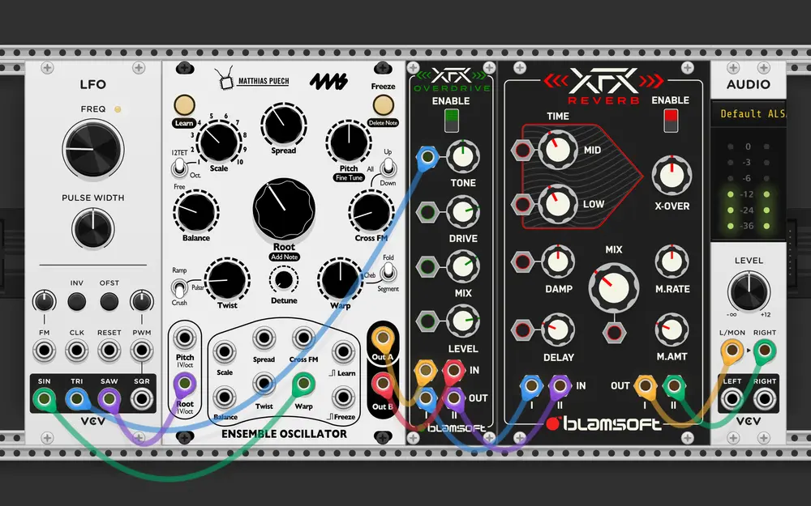
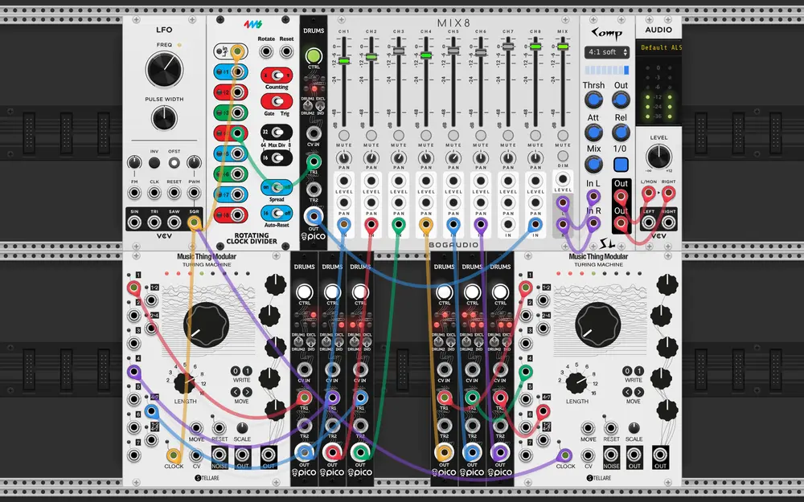

# VCV Rack patches - 2026-Q1

## la matrice  - 2026-01-10 (VCV Rack 2.6.6)

This patch is just one *4ms Ensemble Oscillator* modulated by a slow LFO,
overdriven and riverberated. It sounds like the matrix.

## mum drachine - 2026-01-10 (VCV Rack 2.6.6)

Two *Turing Machine* put six *Pico Drum* through the motion. Another *Pico Drum* for
a 4 on floor base. Play with both *Turing Machine* main knobs to decide how drunk
the drummer is.
