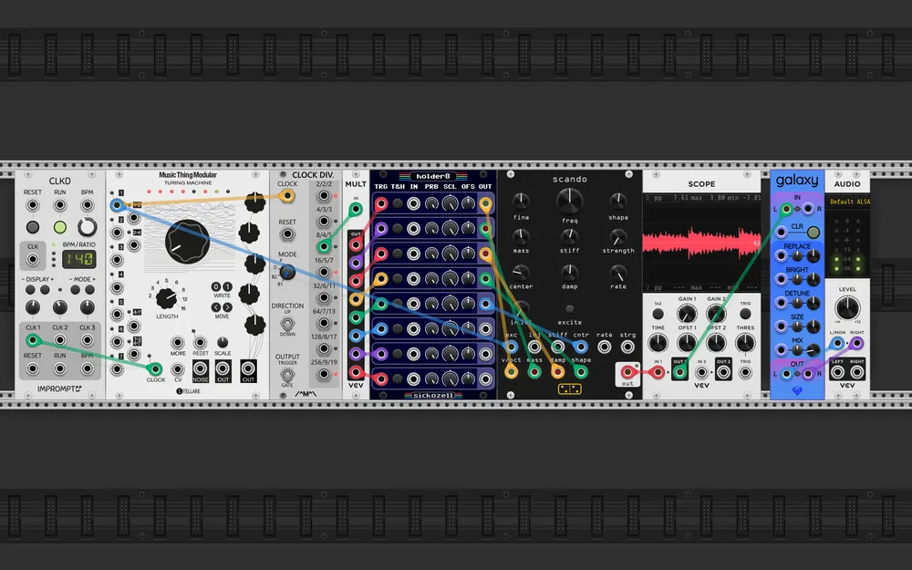

# VCV Rack patches - 2026-Q2

## scando - 2026-06-14 (VCV Rack 2.6.6)

| Plugin | Module | Role in the patch |
|---|---|---|
| Impromptu | Clkd | master clock |
| Stellare Modular | Turing Machine | its pulses both strike the string and feed the divider |
| Count Modula | Clock Divider | ÷8, so the string is retuned far less often than it is struck |
| VCV Free | Mult | fans that slow trigger out to the whole holder bank |
| SickoCV | holder8 | sample and holds, one per scando parameter |
| forsitan modulare | scando | scanned synthesis oscillator, the only voice here |
| VCV Free | Scope | watching the string move |
| Sapphire | Galaxy | reverb |
| VCV Core | Audio 2 | output |

Everything in this patch serves one module. *scando* is a scanned synthesis
oscillator: a mass-spring string, struck and then read around as a wavetable,
so you hear the shape of the string rather than the string itself.

It was a test more than a piece: *scando* had just been released in
*forsitan modulare*, my own plugin, and I wanted to hear how far its sonic
palette went.
