# VCV Rack patches - 2026-Q3

## for eliane - 2026-07-06 (VCV Rack 2.6.6)

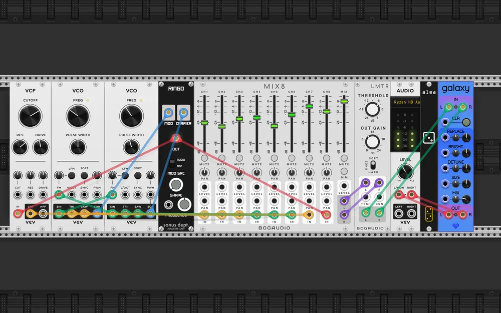

| Plugin | Module | Role in the patch |
|---|---|---|
| VCV Free | VCO ×2 | two oscillators a hair apart, every waveform of each taken at once |
| Sonus Modular | Ringo | ring modulates the two squares against each other |
| VCV Free | VCF | lowpass on the ring modulated pair |
| Bogaudio | MIX8 | eight channels: six raw waveforms, the filter, the ring |
| Bogaudio | LMTR | limiter, because eight summed waveforms clip |
| Sapphire | Galaxy | reverb |
| VCV Core | Audio 2 | output |

Two oscillators detuned by very little, with the sine, triangle and sawtooth of
both taken straight to the mixer, and each one's sine bent into the other's
frequency modulation input. Nothing is sequenced and nothing is clocked: the
whole patch is the beating between the two, arriving at a different rate on
every waveform at once. The ring modulator and the filter add two more voices
made of the same two oscillators.

A homage to Éliane Radigue, whose music this does not come near, but whose
method — two sources, almost in tune, given enough time — is the only
instruction it follows.

## sheep as the symbol of sleep - 2026-07-12 (VCV Rack 2.6.6)

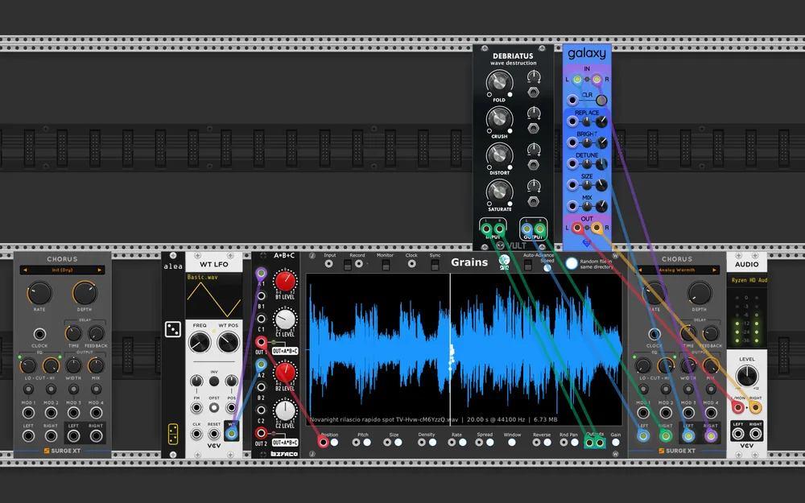

| Plugin | Module | Role in the patch |
|---|---|---|
| JW-Modules | Grains | granular sampler, the only sound source |
| VCV Free | Wavetable LFO | the slow scan |
| Befaco | A*B+C | scales that scan into the grain position range |
| Vult Modules Free | Debriatus | distortion |
| Surge XT | Chorus | widens it |
| Sapphire | Galaxy | reverb |
| VCV Core | Audio 2 | output |

A wavetable LFO generates an oscillation that *A\*B+C* scales and offsets, to
centre it on the interesting part of the sample loaded into *Grains*. The
signal then passes through distortion, chorus and reverb.

There is an advert on Italian television for a melatonin tablet that helps you
sleep well. In it a sheep makes a sound that has always caught my ear
acoustically. I sampled the spot, and in this patch it is the audio source for
a granular exploration.

## stale branch - 2026-07-12 (VCV Rack 2.6.6)

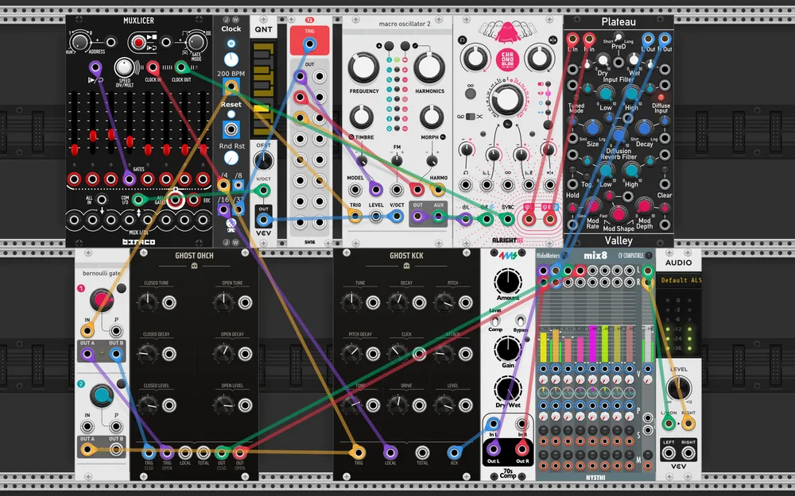

| Plugin | Module | Role in the patch |
|---|---|---|
| JW-Modules | Simple Clock | master clock, with the /4, /16 and /32 taps doing all the timing |
| Befaco | Muxlicer | the melodic sequencer |
| VCV Free | Quantizer | its steps into a scale |
| Tiny Tricks | Sample and hold x16 | every 32 clocks, three new values for the oscillator |
| Audible Instruments | Macro Oscillator 2 | Plaits, the melodic voice |
| Alright Devices | Chronoblob2 | clock synced delay |
| Valley | Plateau | reverb |
| Audible Instruments | Bernoulli Gate | coin flips: open or closed hat, and whether the kick fires |
| Ghost | GHOST OHCH | hi-hats, open and closed |
| Ghost | GHOST KCK | kick |
| ProducerPack | 70sComp | compressor on the kick |
| NYSTHI | mix8 | mixer |
| VCV Core | Audio 2 | output |

Four voices, not much unpredictability. A couple of *Bernoulli Gate* channels
decide when the kick sounds, and when an open hi-hat sounds instead of a closed
one. A couple of sample and holds, driven by a clock divided by 32, change
*Plaits*' parameters.

I wanted to try out the *GHOST* drum modules, and put a fairly unoriginal
*Plaits* sequence over the top. Nothing to write home about, all told.
Predictable, but not that bad either, really.

## apathy and scurvy - 2026-07-20 (VCV Rack 2.6.6)

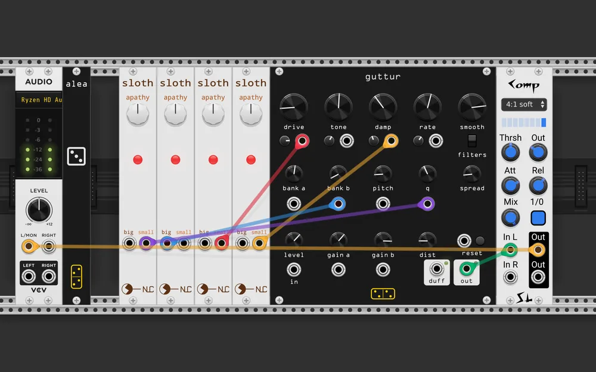

| Plugin | Module | Role in the patch |
|---|---|---|
| forsitan modulare | guttur | chaotic resonator drone, the entire voice |
| Nonlinear Circuits | Sloth Apathy ×4 | four chaotic slow LFOs, one per destination |
| Squinky Labs | Comp | compressor |
| VCV Core | Audio 2 | output |

I made this patch after building *guttur*, because it uses an unconventional
kind of synthesis and it is hard to find the hot spots where the interesting
sounds are. The patch uses the *NLC Sloths* to randomize its parameters slowly,
and explore some of *guttur*'s sonic possibilities.

## tilt shift - 2026-07-21 (VCV Rack 2.6.6)

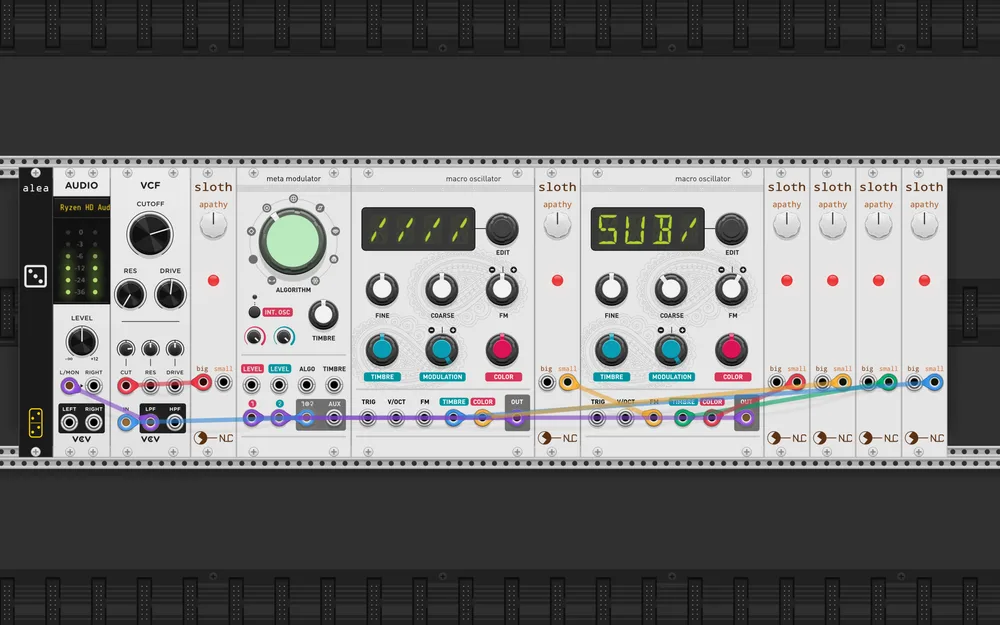

| Plugin | Module | Role in the patch |
|---|---|---|
| Audible Instruments | Macro Oscillator ×2 | Braids, one carrier and one modulator |
| Audible Instruments | Meta Modulator | Warps, folding the two into each other |
| Nonlinear Circuits | Sloth Apathy ×6 | six chaotic LFOs, one per destination |
| VCV Free | VCF | lowpass, its cutoff on the slowest Sloth |
| VCV Core | Audio 2 | output |

*Braids* (Macro Oscillator) is a module that will never leave my heart. Famous
as it is, I think it is badly underrated, and its expressive possibilities are
not explored enough. This patch is one of those explorations: two *Braids*
modulated slowly by a pack of *NLC Sloths*, the two signals set into each other
with *Warps* (Meta Modulator), the whole thing seasoned with a good lowpass
filter. I love drones, I love noise, and I love noisy drones. Where we are
going, we do not need clocks.

## little psychedelia - 2026-07-25 (VCV Rack 2.6.6)

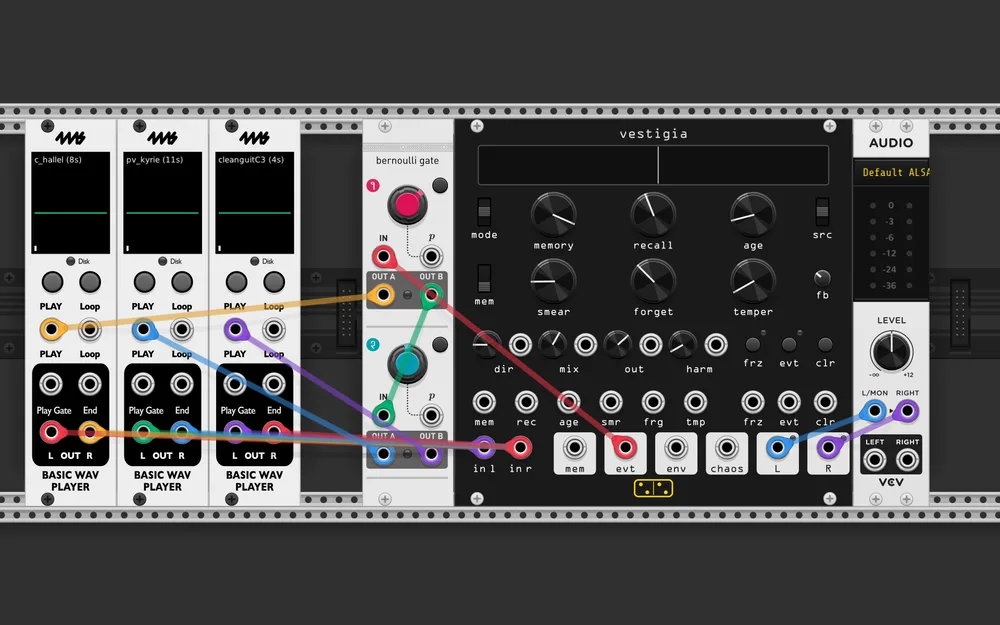

| Plugin | Module | Role in the patch |
|---|---|---|
| 4ms | Basic WAV Player ×3 | three samples |
| forsitan modulare | vestigia | stereo memory effect, fed by all three |
| Audible Instruments | Bernoulli Gate | routes vestigia's own recall events back as play triggers |
| VCV Core | Audio 2 | output |

The patch has to be set in motion by hitting play on one of the three sample
players. Of course you will not have the same samples I have, so load in
something that sounds good together, but not too similar to each other.
*vestigia* listens to the audio input, remembers it, and generates audio events
out of it. The event output triggers a *Bernoulli Gate* that routes a play
trigger at random to one of the sample players. The sample beast remembers, the
sample beast feeds itself.

## tundo graph - 2026-08-07 (VCV Rack 2.6.6)

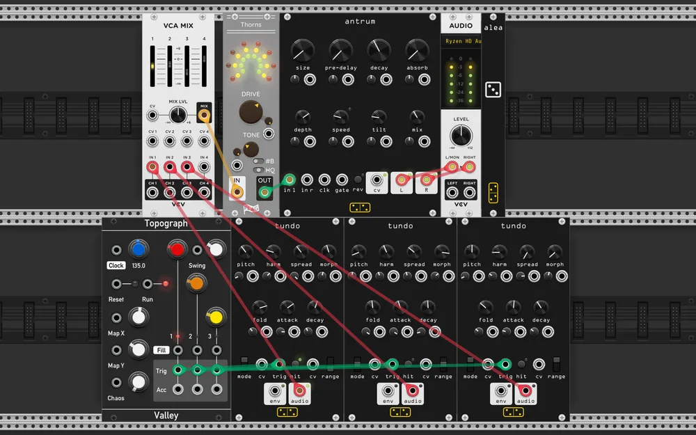

| Plugin | Module | Role in the patch |
|---|---|---|
| Valley | Topograph | Mutable Grids: three streams of drum triggers |
| forsitan modulare | tundo ×3 | one drum voice per stream |
| VCV Free | VCA Mix | mixes the three |
| FLAG Free | Thorns | distortion on the whole kit |
| forsitan modulare | antrum | reverb |
| VCV Core | Audio 2 | output |

A test patch, to hear what *tundo* sounds like. I made a small drum machine out
of three of them, with *Topograph* so I would not have to bother sequencing a
drum pattern myself. Play with Topograph's X and Y parameters to explore the
latent space of a drummer's mind. Distortion and reverb added to taste, before
serving at the table, piping hot.

## vortexcal - 2026-08-09 (VCV Rack 2.6.6)

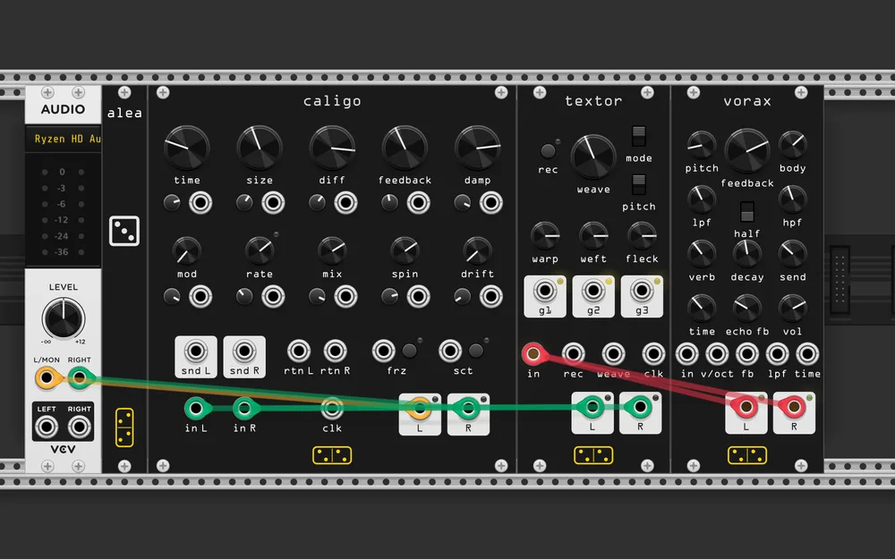

| Plugin | Module | Role in the patch |
|---|---|---|
| forsitan modulare | vorax | feedback drone synthesizer, the source |
| forsitan modulare | textor | loop weaver, two seconds rewoven at every turn |
| forsitan modulare | caligo | Greyhole echo, a long modulated delay in an allpass diffuser |
| VCV Core | Audio 2 | output |

Look mum, I made ambient drone at home! Three *forsitan modulare* modules
working together so we do not feel alone. To get anything going you have to
start the recording on *textor*, which stops by itself after sampling a couple
of seconds of howling from *vorax*. If you do not like the loop that comes out,
just turn the weave knob a little. Or wait a while, the loops evolve slowly.
*caligo* has the single job of carrying us out into interstellar space.

## scrappy apathic twenties - 2026-08-11 (VCV Rack 2.6.6)

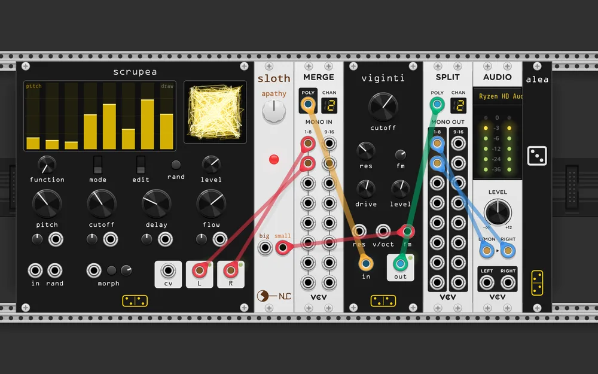

| Plugin | Module | Role in the patch |
|---|---|---|
| forsitan modulare | scrupea | chaotic bank: 16 oscillators into tuned feedback combs |
| VCV Free | Merge | its stereo pair into one polyphonic cable |
| forsitan modulare | viginti | MS-20 lowpass, filtering both channels at once |
| Nonlinear Circuits | Sloth Apathy | chaotic LFO on the cutoff |
| VCV Free | Split | back apart into stereo |
| VCV Core | Audio 2 | output |

The title is a pun on its three modules: **scr**upea, Sloth **Apathy**, and
*viginti*, which is twenty in Latin.

But what do you want, that I turn the volume down? *scrupea* rips the face off
your face, *viginti* tries to stick it back on with a bit of glue. In the end
beauty is a subjective concept, no?

## grone recreation - 2026-08-12 (VCV Rack 2.6.6)

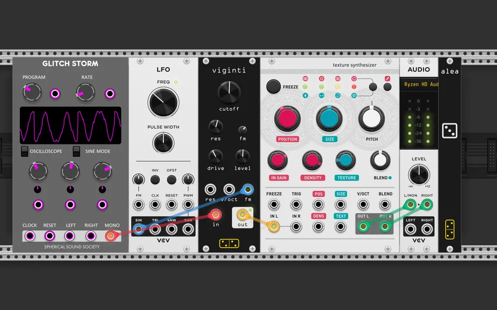

| Plugin | Module | Role in the patch |
|---|---|---|
| Spherical Sound Society Free | GlitchStorm | the source, a byte-beat style generator |
| forsitan modulare | viginti | MS-20 lowpass |
| VCV Free | LFO | sweeps the cutoff |
| Audible Instruments | Texture Synthesizer | Clouds, in texture mode |
| VCV Core | Audio 2 | output |

Five cables, which is as short as a signal path gets. *GlitchStorm* generates,
the MS-20 filter takes the top off it with an LFO walking the cutoff, and
*Clouds* turns whatever it is handed into a slowly breathing texture.

It is an attempt at recreating the [Maneco Labs
Grone](https://manecolabs.com/), a eurorack drone synthesizer, out of modules
that were never meant to be one: a generator with no tuning to speak of, a
filter with a mind of its own, and a texture stage to hold the result together.
Not the same instrument, but it drones in the same direction.

## phiano rhomano - 2026-08-13 (VCV Rack 2.6.6)

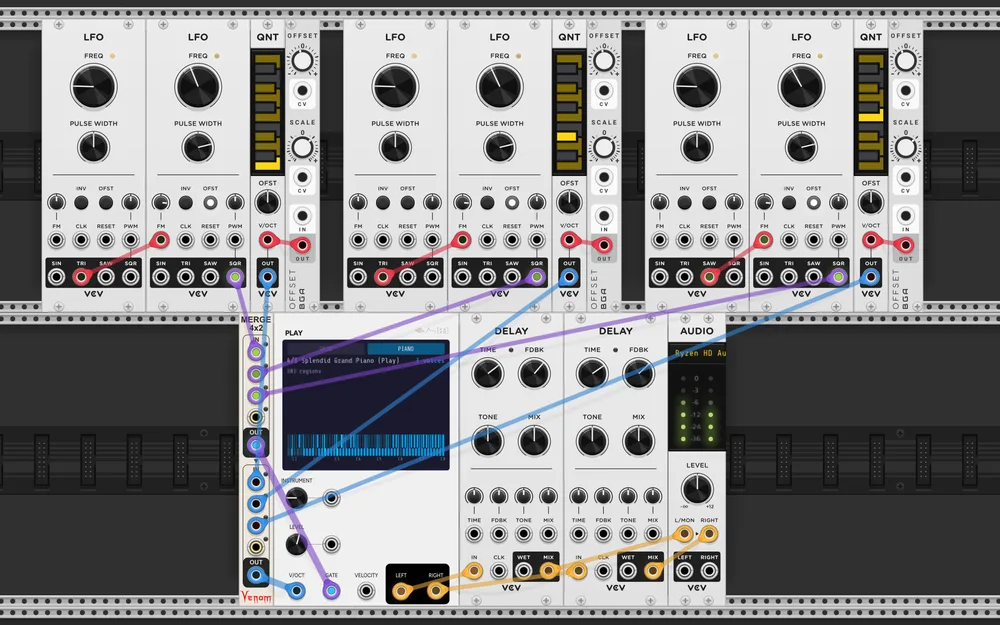

| Plugin | Module | Role in the patch |
|---|---|---|
| VCV Free | LFO ×6 | two per voice: one making gates, one modulating its rate |
| Bogaudio | OFFSET ×3 | sets each voice's pitch range |
| VCV Free | Quantizer ×3 | one per voice, offsets into notes |
| Venom | Merge 4x2 | three gates and three pitches into two polyphonic cables |
| Signal Function Set | Play | sample player, three voices at once |
| VCV Free | Delay ×2 | one per output channel |
| VCV Core | Audio 2 | output |

Three identical voices, and the trick is in each one being slightly wrong. A
square LFO makes the gates while a second LFO modulates that first one's rate,
so no voice keeps a steady tempo and no two of them stay lined up for long.
Their pitches come from a fixed offset through a quantizer, so each voice has
its own register and its own handful of notes.

All three are merged into one polyphonic gate cable and one polyphonic pitch
cable, handed to a single sample player, and the two outputs each get a delay.
Three players at one piano, none of them counting.

## three pedestals (disquiet 0763) - 2026-08-14 (VCV Rack 2.6.6)

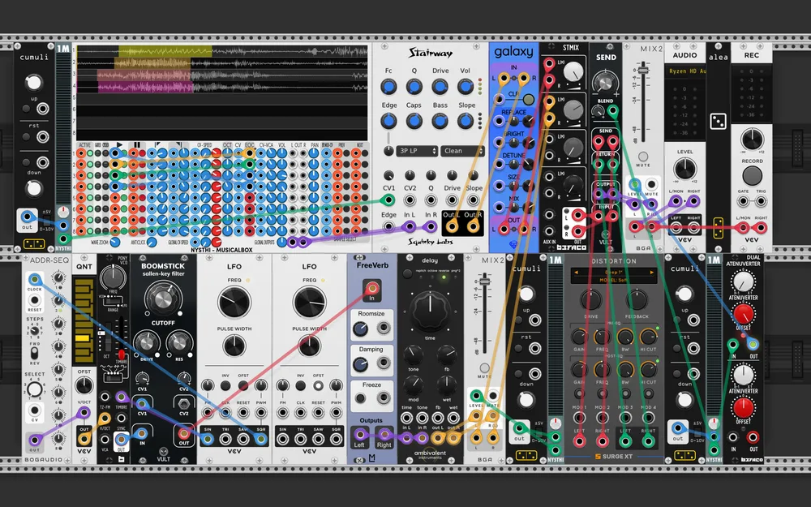

| Plugin | Module | Role in the patch |
|---|---|---|
| NYSTHI | MusicalBox | the first voice, a music box |
| Squinky Labs | Stairway | filter on it, cutoff from the first pedestal |
| Sapphire | Galaxy | its reverb |
| Bogaudio | ADDR-SEQ + VCV Quantizer | pitches for the second voice |
| Befaco | PonyVCO | the second voice |
| Vult Modules Free | Boomstick | filter and drive on it |
| ML Modules | FreeVerb, Ambivalent Instruments Delay | its reverb and delay |
| forsitan modulare | cumuli ×3 | the three pedestals: accumulators that ramp and stay put |
| NYSTHI | Single VU Meter ×3 | reads each pedestal back out as a control voltage |
| Vult Modules Free | Send + Surge XT Distortion | a distortion in a send loop, blend on the second pedestal |
| Befaco | Dual Atenuverter | scales the third pedestal into a level CV |
| Befaco | STMix, Bogaudio MIX2 ×2 | mixing |
| VCV Recorder | Recorder | for the submission |
| VCV Core | Audio 2 | output |

Made for [Disquiet Junto project 0763: 3
Pedestals](https://disquiet.com/2026/08/13/disquiet-junto-project-0763-3-pedestals/).
Twenty-six modules, but only two voices: a music box through a filter and a
reverb, and a *PonyVCO* through *Boomstick* into a reverb and a delay.

What the title calls pedestals are three *cumuli*, accumulators that ramp up or
down while a gate is held and then stay exactly where they were left. Each one
drives a single thing: the music box's filter cutoff, the blend into the
distortion, and the final mix level. They are the only performance controls in
the patch. Everything else runs on its own, and playing it means leaning on
three pedals and waiting.

The recorded result is on [YouTube](https://www.youtube.com/watch?v=GdOqFZAahUU).

## dac as delay - 2026-08-17 (VCV Rack 2.6.6)

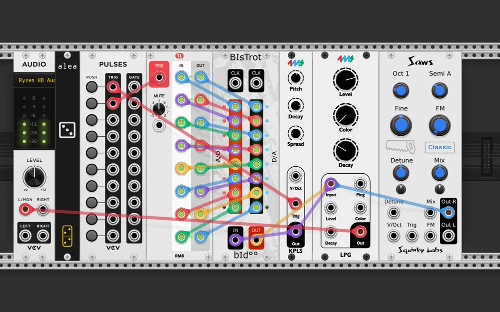

| Plugin | Module | Role in the patch |
|---|---|---|
| Bidoo | BISTROT | the DAC, wired into itself as a delay line |
| Tiny Tricks | Random Mute x8 | passes each channel to the next one up, dropping some at random |
| 4ms | Karplus | plucked source |
| Squinky Labs | Saws | a second source underneath |
| VCV Free | Pulses | two trigger streams |
| 4ms | LPG | low pass gate on the output |
| VCV Core | Audio 2 | output |

The patch is one idea, and the title states it. *BISTROT*'s channels are wired
to each other's neighbours through *Random Mute x8* — channel 1 out to channel
3 in, 2 to 4, and so on up the chain — so a signal put in at the bottom climbs
the module one stage at a time. That is a delay line built out of a converter,
with a quantisation stage at every tap, and the random mutes deciding which
taps survive at all.

*Karplus* plucks into it, *Saws* sits underneath, and the *LPG* at the end
keeps the whole thing from being relentless. Mono, and it should be.

## weird ghosts - 2026-08-17 (VCV Rack 2.6.6)

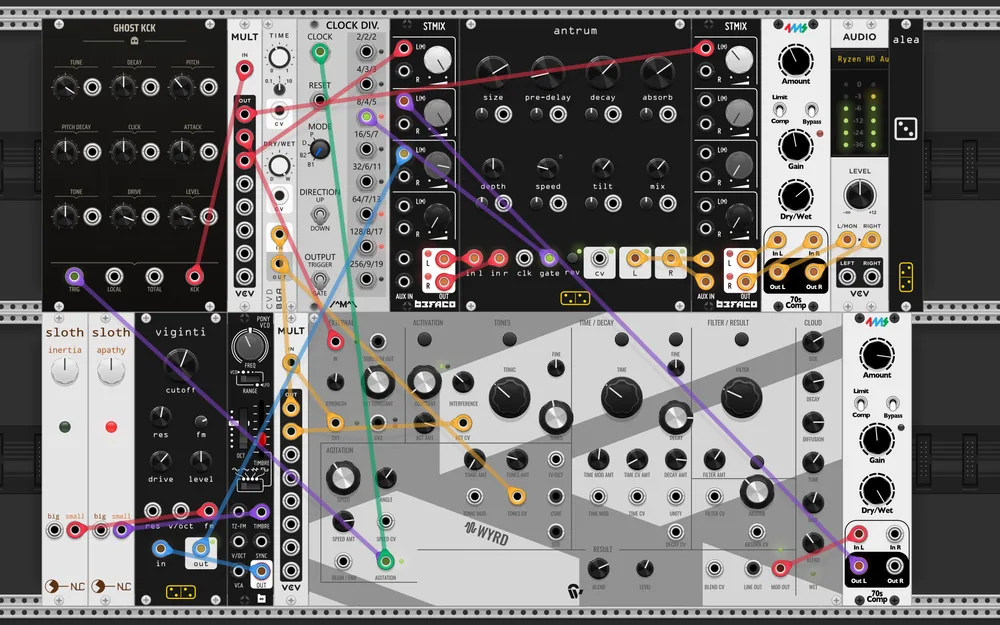

| Plugin | Module | Role in the patch |
|---|---|---|
| Tapestry | Wyrd | the brain: its agitation output is the clock, its CVs run the patch |
| Bogaudio | CVD | delays one of Wyrd's CVs before it returns to Wyrd |
| Ghost | GHOST KCK | kick, on the same agitation |
| Befaco | PonyVCO | the second voice |
| Nonlinear Circuits | Sloth Apathy, Sloth Inertia | chaos on that voice's timbre and cutoff |
| forsitan modulare | viginti | MS-20 lowpass on it |
| Count Modula | Clock Divider | ÷8, gating the reverb's reverse |
| forsitan modulare | antrum | reverb, turned backwards every eighth clock |
| Befaco | STMix ×2 | mixing |
| ProducerPack | 70sComp ×2 | compression |
| VCV Core | Audio 2 | output |

*Wyrd* runs everything: it is the clock, by way of its agitation output, and
its CV outputs come back into its own inputs through *CVD*, so it modulates
itself with a delayed copy of itself and never quite repeats. The kick fires on
that same agitation.

Beside it, a *PonyVCO* through *viginti* is pushed around by two *Sloths*.
Both meet in the mixers and go through *antrum*, whose reverse gate is switched
by a ÷8 divider — every eighth clock the room turns backwards and then turns
back. The name is the *Wyrd* and the *GHOST* modules, and the patch does sound
haunted.
